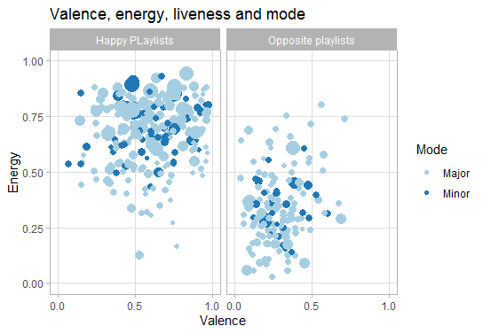

# computationalmusicology
My computational musicology portfolio

**Week 6**

What I would like to examine is ‘What does it mean to be a ‘happy’ playlist?’ or ‘What makes a playlist ‘happy’ if you compare it to playlists with negative emotions in the title?’

What I am going to do is comparing playlists with ‘happy’ in the title to playlists that have opposite emotions in the title (e.g. sad). My corpus consist out of three playlists with the ‘happy’ in the title. Two playlists exist out of 100 songs and the other one out of 80. The other part of the corpus exist out of two playlists (‘Life sucks’ and ‘Sad songs’) which contain 100 and 60 songs. So the corpus represents playlists that are meant to be ‘happy’ and playlists that are not meant to be ‘happy’. The label ‘happy’ is chosen by Spotify so it represents that label well, but the other playlists are chosen by me and I feel like these playlists are the opposite of ‘happy’, but since it is not chosen by Spotify it might be that these labels overlap or are not related at all. 

There seems to be a significantly difference in energy for ‘happy’ playlists and the other Playlists. The happy playlists are more energetic than the other ones (M= .66, SD= .14). The energy level of the other playlists is rather low (M= .31, SD= .14). This seems to be a promising feature for identifying differences between 'Happy'playlists and playlists that are not. Other promising features are:

There’s a significantly difference in valence between the ‘happy’ playlists and the others. The ‘happy’ playlists have a much higher valence (M= .54, SD= .18). The valence for ‘Sad songs’ and ‘Life sucks’ is very low (M= .28, SD= .13).

The mean for the dancebility of the sad songs is at least 0.64 and the other playlists are lower (both 0.51). So ‘happy’ playlists have a higher danceability, but the difference is small. 

What is remarkable is that there doesn’t really seem to be a difference in the mode. They are all mostly major. I expected there to be a difference. The happy songs (M= .66, SD= .48) in major and the other playlists (M= .78, SD= .42) in minor, but that is'nt the case.

There aren't any extremes or outliers in my corpus, so I do not have to think about including or excluding any of them.

**Week 7**

This plot is about the valence, energy, liveness and mode of the two kinds of playlists. It is based on the plot of Dr John Ashley Burgoyne that was showed in class. I wanted to use different colors from the same package, but I don't know yet how to do that.The plot shows that the valence and energy for most songs in the happy playlists are high, while for the other kind of playlists the valence and energy are low. This is the same pattern as I already saw last week. Another pattern that I saw last week is that there isn't really a difference in the mode of both kind of playlists. What also can be seen in the graph is that 'Happy songs' tend to have a higher liveness, then songs in the other playlists. When I checked this audio feature last week I didn't see that there is such a difference between the playlists(M=.18, SD=.14 for 'Happy' and M=.13, SD=.06). This is something I didn't expect to find, so I would like to investigate this further in the coming weeks.    

Last week I thought there were'nt any outliers, but there seem to be some. I don't think they will effect the results, because there are many songs that aren't outliers. So I won't take the outliers out.
